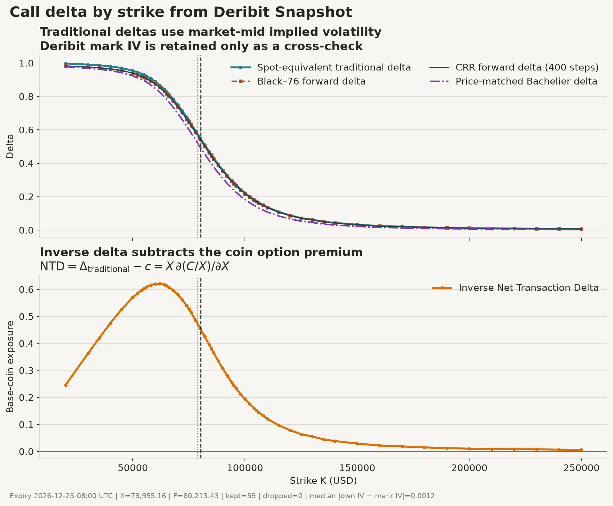

# PRISM: Live Volatility Surface, Pricing Engine and Quoting Simulator

## Reproduction

```bash
python -m pip install -e .

# All unit tests
make test

# Deribit connection tests
make integration

# Capture a live snapshot and render delta/strike figure
make snapshot

# Run tests and reproduce the checked-in report figure
make all
```

## Market Data Transport

PRISM streams live order book, instrument, and index data from Deribit (BTC, ETH, SOL).

### REST vs. Persistent WebSockets

To price option chains accurately, market snapshots must be captured with zero internal latency skew between the index price and option quotes. Standard REST batching requires multiple independent HTTP connections, creating concurrency bottlenecks and severe exchange server-side time skew.

PRISM uses **JSON-RPC 2.0 over a single persistent WebSocket stream (`wss://`)**:
* **Multiplexed Single Pipe:** All 4 snapshot frames (`index`, `instruments`, `options`, `futures`) are pipelined down a single WebSocket connection.
* **Request Correlation:** Unique incrementing `id` parameters correlate asynchronous frame returns back to their caller keys.
* **Connection Persistence:** Eliminates repeated TCP/TLS handshakes, reducing post-warmup request dispatch latency to sub-millisecond windows.

### Transport Performance (Testnet Benchmark)

| Metric | Async HTTP REST | Persistent WebSocket (`wss://`) | Notes |
| :--- | :--- | :--- | :--- |
| **Warm-Up Cost** | ~250 ms / request | **~1,100–1,300 ms** | One-time TCP/TLS handshake establishing `wss://`. |
| **RTT Window** | ~250–300 ms | **~30–300 ms** | Physical fiber RTT to Equinix LD4 (London). |
| **Server Skew (`usOut`)** | **2,000–8,000+ ms** | **~15–30 ms** | Timestamp delta between index and options processing. |

### Data Coherence & Server Skew

Fetching 4 separate REST endpoints introduces **2 to 8 seconds of exchange server skew**. In fast markets, a $200 index move mid-fetch skews option mark prices and distorts the implied volatility surface. Pipelining JSON-RPC frames over a single WebSocket forces Deribit to process the snapshot sequentially in **< 30 ms**, delivering a synchronized freeze-frame of the market.

---

## Deribit Inverse Options

PRISM is primarily a learning project for Deribit's inverse BTC and ETH options. Deribit inverse options are European: they cannot be exercised early, and open in-the-money positions are handled automatically at expiry ([Deribit: Inverse Options](https://support.deribit.com/hc/en-us/articles/31424939096093-Inverse-Options)).

The word describes the contract's denomination and payoff convention:

* The option premium is quoted in the base coin, such as BTC or ETH.
* Margin and settlement are also in that base coin.
* The strike and delivery price are expressed in USD.
* One contract represents one unit of the underlying coin.

For delivery price $D$ and strike $K$, one inverse BTC call pays:

$$
H_T^{BTC}=\frac{(D-K)^+}{D}.
$$

Multiplying by $D$ exposes an ordinary USD call payoff:

$$
DH_T^{BTC}=(D-K)^+=H_T^{USD}.
$$

**A BTC-settled call is not itself a Black-Scholes USD call because it pays $\frac{(D-K)^+}{D}$ BTC rather than $(D-K)^+$ USD, so its coin value and spot Greeks also differentiate the reciprocal conversion factor $\frac{1}{D}$.**

This identity gives the replication argument:

1. Replicate the ordinary USD call with the standard dynamic hedge.
2. At expiry, the hedge is worth $(D-K)^+$ USD.
3. Convert that amount at the delivery price $D$.
4. The resulting BTC is exactly $\frac{(D-K)^+}{D}$.

The USD pricing model is therefore still useful. `inverse.py` is deliberately a denomination adapter rather than another `OptionModel`: the current index is required to convert a cash value into coin, while the existing pricing interface intentionally takes an expiry forward.

If $C(X)$ is the USD option value and $c(X)=\frac{C(X)}{X}$ is its BTC value, then:

$$
\Delta_{USD}=\frac{\partial C}{\partial X},
\qquad
\frac{\partial c}{\partial X}
=\frac{X\Delta_{USD}-C}{X^2}.
$$

The price-adjusted base-coin exposure is:

$$
\mathrm{NTD}
=X\frac{\partial c}{\partial X}
=\Delta_{USD}-c.
$$

Deribit calls this **Net Transaction Delta**: individual option tickers report standard Black-Scholes delta, while account-level `DeltaTotal` uses Black-Scholes delta minus the option mark price ([Deribit ticker Greeks](https://docs.deribit.com/api-reference/market-data/public-ticker)).

This differs from a classical quanto. A quanto has a separate underlying-price process and settlement-FX process, so its price can contain an FX-volatility and correlation adjustment. An inverse option uses $\frac{1}{X}$, the reciprocal of the underlying itself; there is no independent FX factor or correlation parameter.

For a parameter $(y)$ that does not move the index denominator:

$$
\frac{\partial c}{\partial y}
=\frac{1}{X}\frac{\partial C}{\partial y}.
$$

For example:

$$
\nu_{BTC}=\frac{\nu_{USD}}{X}.
$$

Mixed spot sensitivities include the denominator term:

$$
\mathrm{Vanna}_{BTC}
=\frac{X\,\mathrm{Vanna}_{USD}-\nu_{USD}}{X^2}.
$$

Every reported Greek therefore states its value currency, bumped variable, and held-fixed convention. A forward delta, traditional spot delta, raw coin-premium derivative, and NTD are related but are not interchangeable.

### Doubling and Halving

If $(K)$ is the initial reference level:

| Delivery price | Call BTC payoff | Call USD payoff | Put BTC payoff | Put USD payoff |
| :--- | ---: | ---: | ---: | ---: |
| $D=\frac{K}{2}$ | \(0\) | \(0\) | \(1\) BTC | $\frac{K}{2}$ |
| $D=K$ | \(0\) | \(0\) | \(0\) | \(0\) |
| $D=2K$ | $(\frac{1}{2})$ BTC | \(K\) | \(0\) | \(0\) |

As $D \to \infty$, the inverse call approaches one BTC while its USD payoff remains unbounded. As $D \to 0$, the inverse put requires an unbounded number of increasingly cheap BTC while its USD payoff approaches the finite strike.


---

## Pricing Engine & Model Layer

PRISM uses a pluggable model interface (`OptionModel`) exposing standard `price()`, `greeks()`, and `implied_vol()` signatures.

### Implemented Models

* **Black-Scholes (Spot-Based):** Standard spot pricing model ($S$). Assumes continuous lognormal asset dynamics and evaluates spot-constrained derivatives ($\frac{\partial V}{\partial S}\big|_r$).
* **Black-76 (Forward-Based):** Futures/forward pricing model ($F$). Evaluates forward-constrained derivatives ($\frac{\partial V}{\partial F}\big|_r$).
* **Bachelier (Forward-Based Normal Model):** Assumes normally distributed changes in the expiry forward. Its volatility $\sigma_N$ is measured in price units per square-root year rather than as a percentage.
* **Binomial (Forward Tree):** Builds a discrete Cox-Ross-Rubinstein tree for the expiry forward and prices European options by backward induction. The implementation deliberately contains no early-exercise branch.
* **Inverse:** Converts cash value and cash Greeks into BTC/ETH value, raw coin sensitivites, and Net Transaction Delta. *Not* a separate stochastic model.

### Spot vs. Forward Greeks
While Black-Scholes and Black-76 yield identical option prices when $F = S e^{r\tau}$, their **Greeks represent different partial derivatives**:

* Bumping Spot $S$ implicitly moves Forward $F$ via cost-of-carry ($F = S e^{r\tau}$).
* Chain Rule ($\frac{\partial F}{\partial S} = e^{r\tau}$) links Spot and Forward sensitivities:

$$\Delta_{\text{BS}} = \frac{\partial V}{\partial S} = \frac{\partial V}{\partial F} \cdot \frac{\partial F}{\partial S} = e^{r\tau} \Delta_{76} = \Phi(d_1) \quad (\text{Call})$$

$$\Gamma_{\text{BS}} = \frac{\partial^2 V}{\partial S^2} = e^{2r\tau} \Gamma_{76} = \frac{\phi(d_1)}{S \sigma \sqrt{\tau}}$$

$$\text{Rho}_{\text{BS}} = +K \tau e^{-r\tau} \Phi(d_2) \quad \text{vs.} \quad \text{Rho}_{76} = -\tau \cdot \text{CallPrice}_{76}$$

*Note:* A Black-Scholes call is **long rates** (higher rates increase forward drift, raising call value), whereas a Black-76 call is **short rates** (higher rates increase the discount factor $e^{-r\tau}$ on a fixed forward).

### Model Formulations ($q = 0$)
| Metric / Greek | Black-Scholes (Spot $S$) | Black-76 (Forward $F$) |
| :--- | :--- | :--- |
| **$d_1$** | $\frac{\ln(S/K) + (r + \frac{1}{2}\sigma^2)\tau}{\sigma\sqrt{\tau}}$ | $\frac{\ln(F/K) + \frac{1}{2}\sigma^2\tau}{\sigma\sqrt{\tau}}$ |
| **$d_2$** | $d_1 - \sigma\sqrt{\tau}$ | $d_1 - \sigma\sqrt{\tau}$ |
| **Call Price** | $S \Phi(d_1) - K e^{-r\tau} \Phi(d_2)$ | $e^{-r\tau} [F \Phi(d_1) - K \Phi(d_2)]$ |
| **Call Delta ($\Delta$)** | $\Phi(d_1)$ | $e^{-r\tau} \Phi(d_1)$ |
| **Gamma ($\Gamma$)** | $\frac{\phi(d_1)}{S \sigma \sqrt{\tau}}$ | $\frac{e^{-r\tau} \phi(d_1)}{F \sigma \sqrt{\tau}}$ |
| **Vega ($\mathcal{V}$)** | $S \phi(d_1) \sqrt{\tau}$ | $F e^{-r\tau} \phi(d_1) \sqrt{\tau}$ |
| **Call Rho ($\rho$)** | $+K \tau e^{-r\tau} \Phi(d_2)$ | $-\tau \cdot \text{CallPrice}_{76}$ |

### Delta-vs-Strike Figure

Deribit defines `underlying_price` as the price used for option Implied Volatility (IV) calculations and supplies mark price and mark IV in its option summary ([Deribit book-summary API](https://docs.deribit.com/api-reference/market-data/public-get_book_summary_by_currency)). PRISM does not use the published mark IV as a model input.



The upper panel shows model deltas. They generally decrease from one toward zero as call strike rises. Cox-Binomial should track Black-76 with finite-step oscillation; Bachelier can differ in the wings because normal and lognormal tails differ.

The lower panel shows inverse NTD. Its hump shape may be interpreted as:

* deep ITM: the coin call premium approaches its 1-BTC ceiling, reducing incremental coin exposure;
* around the active exercise region: both exercise probability and price sensitivity matter;
* deep OTM: exercise probability approaches zero.

## Implied Volatility Engine

Implied volatility ($\sigma$) is solved using a two-stage root finder:

1. **Newton-Raphson (Primary):**
   $$\sigma_{n+1} = \sigma_n - \frac{V(\sigma_n) - P_{\text{market}}}{\mathcal{V}(\sigma_n)}$$
   Converges in 3–4 iterations for near-the-money quotes.
2. **Brent's Method Fallback:**
   For deep OTM options, analytical Vega ($\mathcal{V}$) approaches zero, causing Newton-Raphson to diverge or divide by zero. If Vega falls below $10^{-12}$, the solver falls back to `scipy.optimize.brentq` over $[10^{-6}, 5.0]$ to guarantee $10^{-10}$ convergence.

### Volatility Space Stopping Rule

Stopping rules evaluated in dollar space ($|P_{\text{calc}} - P_{\text{market}}| < 10^{-10}$) break down on deep OTM options where Vega is tiny ($\sim 10^{-4}$), leaving errors as large as $10^{-6}$ in volatility space. PRISM enforces convergence directly in **volatility space**:

$$\left| \frac{P_{\text{calc}} - P_{\text{market}}}{\mathcal{V}} \right| < 10^{-10}$$

---

## Unit Testing & Verification

The pricing test suite (`tests/test_pricing.py`) runs 57 automated assertions covering IV inversion, Put-Call Parity, boundary conditions, and analytical Greeks verified against central finite differences.

### Relative Finite-Difference Step Scaling ($h$)

Using a fixed absolute bump size (e.g., $h = 10^{-4}$) at $S = \$65,000$ falls below the float64 ULP cancellation floor for 2nd derivatives, producing negative Gamma values from machine roundoff noise. 

Central difference step sizes scale relative to the variable magnitude ($x$) based on float64 machine epsilon ($\epsilon \approx 2.22 \times 10^{-16}$):

* **1st Derivatives ($\Delta, \mathcal{V}, \Theta, \rho, \text{Vanna}, \text{Vomma}$):** $h = x \cdot \epsilon^{1/3} \approx x \cdot (6 \times 10^{-6})$
* **2nd Derivatives ($\Gamma$):** $h = x \cdot \epsilon^{1/4} \approx x \cdot (1.2 \times 10^{-4})$

At $S = \$65,000$, Gamma is tested using $h \approx \$7.80$, guaranteeing numerical stability.

### Test Coverage Summary

* **$10^{-10}$ IV Roundtrips:** Verifies $P \to \sigma \to P$ recovery across strikes ($\$50\text{k}, \$65\text{k}, \$80\text{k}$) and volatilities ($20\%, 55\%, 120\%$) for both Spot and Forward models.
* **Put-Call Parity:** Asserts $C - P = S - K e^{-r\tau}$ (BS) and $C - P = e^{-r\tau}(F - K)$ (B76) to $10^{-8}$ precision.
* **Finite-Difference Convergence:** Analytical Greeks match central differences within relative tolerances ($10^{-8}$ for Delta/Vega, $10^{-6}$ for Gamma/Vanna/Vomma).
* **Arbitrage Bounds:** Sub-intrinsic and above-ceiling prices explicitly raise `ValueError` to prevent surface fitting corruption.