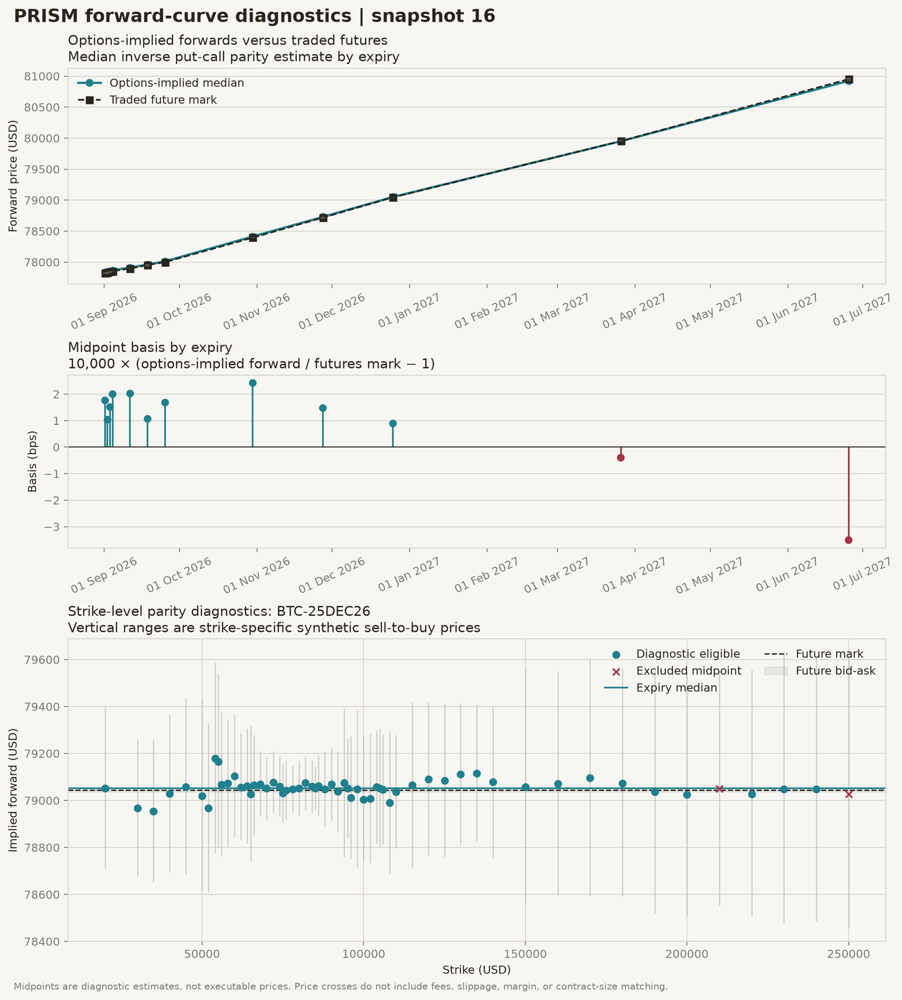
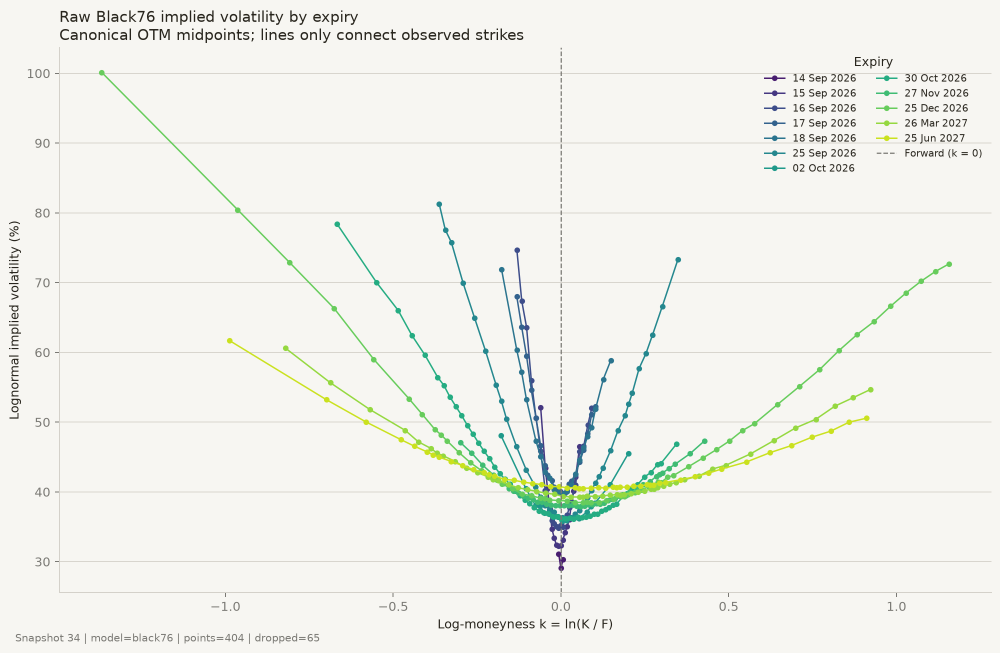
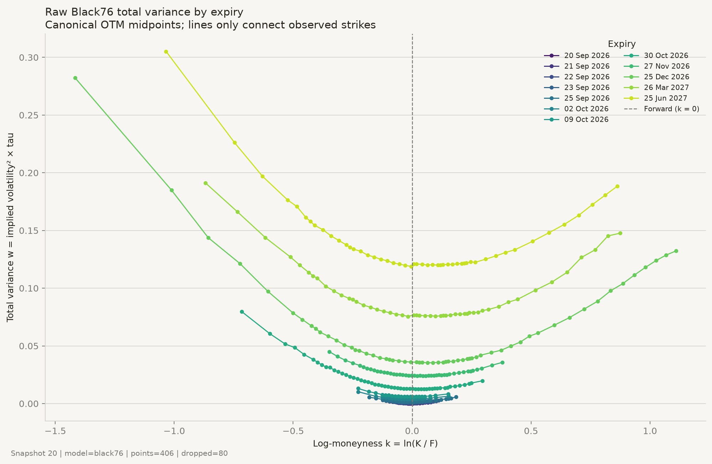

# PRISM

PRISM is a research pipeline for Deribit inverse crypto options. It captures
coherent option-chain snapshots, derives expiry forwards from put-call parity,
recovers implied volatility independently of the exchange mark IV, and fits
butterfly-checked SVI smiles in total-variance space.

The project is designed around a trading question: which part of the volatility
surface is a position exposed to, and does an apparent surface dislocation
remain after executable spreads and hedging costs?

## What the project demonstrates

- **Coherent market data:** JSON-RPC requests over one persistent WebSocket are
  persisted as versioned snapshots.
- **Inverse-option accounting:** coin premiums and Greeks are related to their
  USD-valued counterparts through an explicit replication and quotient-rule
  derivation.
- **Independent pricing:** Black-Scholes, Black-76, Bachelier, and European CRR
  models expose common price, Greek, and implied-volatility interfaces.
- **Forward-curve forensics:** each expiry forward is inferred from call-put
  parity and compared with the traded future.
- **Quote hygiene:** missing sides, zero bids, crossed books, wide spreads, and
  pairing failures are counted rather than silently removed.
- **Volatility coordinates:** canonical OTM observations are expressed in
  log-moneyness \(k=\ln(K/F)\) and total variance \(w=\sigma^2T\).
- **SVI smile fitting:** one expiry is compressed into a raw-SVI parameter set,
  repriced through Black-76, and checked for butterfly arbitrage.

## Current checkpoints

### Inverse and model Greeks


The upper panel compares pricing-model deltas. The lower panel separates
inverse Net Transaction Delta from the raw derivative of a coin-denominated
premium.

### Options-implied forward curve



The chain-implied forward broadly tracks the traded futures curve. Strike-level
synthetic intervals widen where one or both option legs are less liquid.

### Raw volatility observations





The raw views retain one canonical OTM option per strike and do not use
Deribit's mark IV as a calibration input.

### Fitted SVI smile

Run `make svi_smile` to generate a two-panel checkpoint containing the fitted
total-variance smile, market residuals, bid-ask interpretation, fitted
parameters, and butterfly-arbitrage status.

## Reproduce

```bash
python -m pip install -e .

# Offline unit suite
make test

# Capture and inspect a live snapshot
make snapshot
make forward_curve

# Plot the latest stored raw volatility observations
make raw_surface

# Fit the most populated eligible expiry in the latest snapshot
make svi_smile
```

Use an explicit snapshot and expiry for reproducible SVI output:

```bash
python -m benchmarks.svi_smile_plot \
  --db snapshots.db \
  --snapshot-id 34 \
  --expiry 1790323200000 \
  --output figs/svi_smile.png
```

## Architecture

```text
Deribit snapshot
    -> normalized option chain
    -> call-put parity forwards
    -> quote and pairing diagnostics
    -> canonical OTM observations
    -> own implied-volatility inversion
    -> log-moneyness and total variance
    -> per-expiry SVI calibration
    -> price residuals and arbitrage assertions
```

## Knowledge base

- [Market data, snapshots, forwards, and hygiene](deribit/README.md)
- [Pricing models, inverse settlement, and Greeks](deribit/pricing/README.md)
- [Volatility observations, SVI, and arbitrage checks](deribit/surface/README.md)
- [Benchmark and figure commands](benchmarks/README.md)
- [Testing and numerical verification](tests/README.md)

## Current research direction

The first proposed hypothesis is that liquid near-forward quotes with
executable leave-one-out SVI residuals may mean-revert toward the fitted smile.
The current milestone establishes the static fitted representation required to
test that claim. Historical signal construction, delta-hedged P&L, calendar
arbitrage, model-free 30-day variance, and DVOL comparison remain subsequent
checkpoints.

## Status

The current branch implements M1 pricing, M2 forward and chain diagnostics, and
the first M3 per-expiry SVI checkpoint. It does not yet claim a complete
arbitrage-free multi-expiry surface or a profitable strategy.
